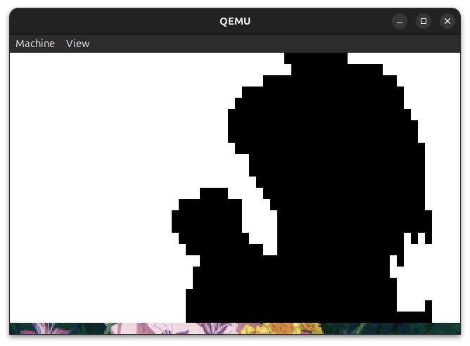

# rOSes_are_red


[(Source)](https://tenor.com/view/reze-reze-movie-silly-reze-flower-reze-flower-gif-2744856434702978368)

## IF2130 Sistem Operasi - 2025/2026



### Daftar Isi

- [Struktur](#struktur)
- [Requirements](#requirements)
- [Cara Run](#cara-run)
- [Fitur yang Dibuat](#fitur-yang-dibuat)

## Struktur
```
root
├── Makefile
├── README.md
├── bin
│   ├── OS2025.iso
│   ├── clock
│   ├── clock_elf
│   ├── cmos.o
│   ├── context-switch.o
│   ├── disk.o
│   ├── ext2.o
│   ├── framebuffer.o
│   ├── gdt.o
│   ├── graphics.o
│   ├── idt.o
│   ├── inserter
│   ├── interrupt.o
│   ├── intsetup.o
│   ├── kernel
│   ├── kernel-entrypoint.o
│   ├── kernel.o
│   ├── keyboard.o
│   ├── paging.o
│   ├── portio.o
│   ├── process.o
│   ├── scheduler.o
│   ├── shell
│   ├── shell_elf
│   ├── storage.bin
│   └── string.o
├── other
│   ├── grub1
│   └── terminal-reze.jpeg
├── packages.microsoft.gpg
├── reze.gif
└── src
    ├── cmos
    │   └── cmos.c
    ├── context-switch.s
    ├── cpu
    │   ├── gdt.c
    │   ├── idt.c
    │   ├── interrupt.c
    │   ├── intsetup.s
    │   └── portio.c
    ├── crt0-echo.s
    ├── crt0.s
    ├── driver
    │   ├── disk.c
    │   └── keyboard.c
    ├── external
    │   ├── clock.c
    │   ├── external-inserter
    │   ├── external-inserter.c
    │   ├── hello-world.c
    │   └── spinner.c
    ├── filesystem
    │   └── ext2.c
    ├── graphics
    │   └── graphics.c
    ├── header
    │   ├── cmos
    │   │   └── cmos.h
    │   ├── cpu
    │   │   ├── gdt.h
    │   │   ├── idt.h
    │   │   ├── interrupt.h
    │   │   └── portio.h
    │   ├── driver
    │   │   ├── disk.h
    │   │   └── keyboard.h
    │   ├── filesystem
    │   │   └── ext2.h
    │   ├── graphics
    │   │   ├── font.h
    │   │   ├── graphics.h
    │   │   └── wallpaper.h
    │   ├── kernel-entrypoint.h
    │   ├── memory
    │   │   └── paging.h
    │   ├── process
    │   │   ├── process.h
    │   │   └── scheduler.h
    │   ├── stdlib
    │   │   └── string.h
    │   └── text
    │       └── framebuffer.h
    ├── kernel-entrypoint.s
    ├── kernel.c
    ├── linker.ld
    ├── memory
    │   └── paging.c
    ├── menu.lst
    ├── process
    │   ├── process.c
    │   └── scheduler.c
    ├── stdlib
    │   └── string.c
    ├── text
    │   └── framebuffer.c
    ├── user-linker.ld
    └── user-shell.c
```

## Requirements
Sebelum menjalankan `rOSes_are_red`, pastikan anda telah mengunduh dan melakukan pengaturan pada kebutuhan berikut: 

- [Netwide Assembler](https://www.nasm.us/)  
- [GNU C Compiler](https://man7.org/linux/man-pages/man1/gcc.1.html) 
- [GNU Linker](https://linux.die.net/man/1/ld)
- [QEMU - System i386](https://www.qemu.org/docs/master/system/target-i386.html) 
- [GNU Make](https://www.gnu.org/software/make/) 
- [genisoimage](https://linux.die.net/man/1/genisoimage) 
- [GDB](https://man7.org/linux/man-pages/man1/gdb.1.html) 	

untuk mengunduh kebutuhan file tersebut, jalankan kode berikut pada terminal WSL

```bash
$ sudo apt update
$ sudo apt install -y nasm gcc qemu-system-x86 make genisoimage gdb
```


###

## Cara Run
Pada terminal WSL, buka direktori tempat anda menyimpan proyek ini dan jalankan
```bash
$ make restart
```

Setelah perintah berhasil, inisialisasi program dengan menekan `f5` atau `fn + f5`. Perintah ini akan menjalankan shell untuk proses inisialiasi. Setelah proses telah berhasil diinisialisasi(telah muncul jendela QEMU), hentikan proses dengan kembali menekan `f5` atau `fn + f5`.

Setelahnya, lakukan perintah berikut pada terminal WSL,
```bash
$ make insert-shell
```

Setelah perintah berhasil, jalankan program dengan kembali menekan `f5` atau `fn + f5`. 

Untuk menambahkan fungsionalitas, lakukan perintah berikut sebelum menjalankan program,

```bash
$ make insert-clock
```


## Fitur yang Dibuat

Pada projek ini, terdapat 13 fungsionalitas yang dapat digunakan antara lain, 
| Perintah | Fungsionalitas |
| :--- | :--- |
| `cd <direktori>` | Ganti direktori saat ini |
| `ls` | Daftar isi direktori saat ini |
| `cat <file>` | Tampilkan isi file |
| `mkdir <nama_dir>` | Buat direktori baru |
| `cp <sumber> <tujuan>` | Salin file atau direktori |
| `rm <file>` | Hapus file |
| `mv <sumber> <tujuan>` | Pindah atau ganti nama file/direktori |
| `grep <pola> <file>` | Cari pola dalam file |
| `find <nama>` | Cari file atau direktori secara rekursif |
| `exec <path_program>` | Jalankan program baru |
| `ps` | Tampilkan daftar proses berjalan |
| `kill <nama>` | Hentikan proses berdasarkan PID atau nama |
| `clear` | Bersihkan layar terminal |
| `help` | Tampilkan menu bantuan |


